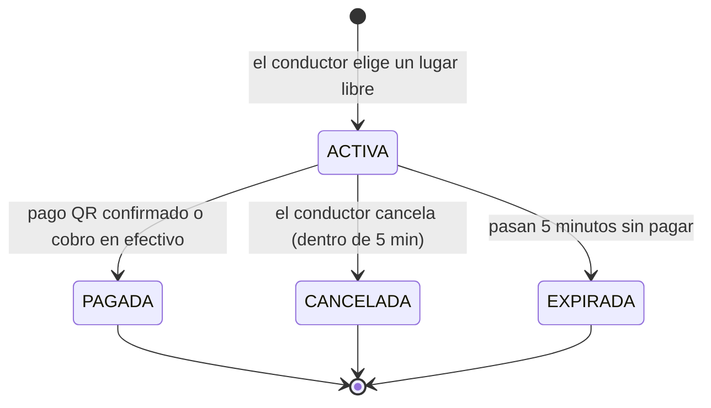
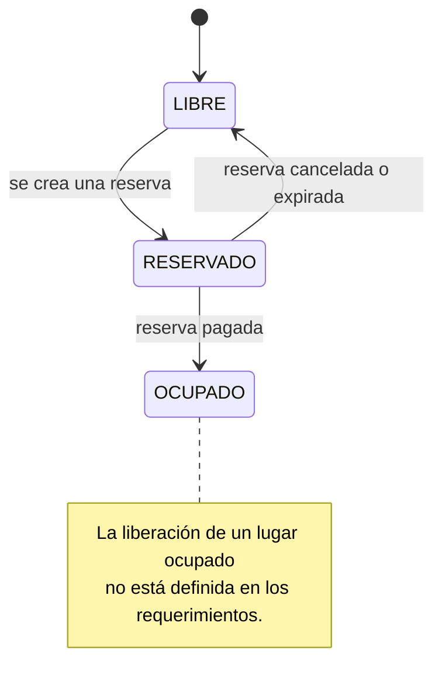
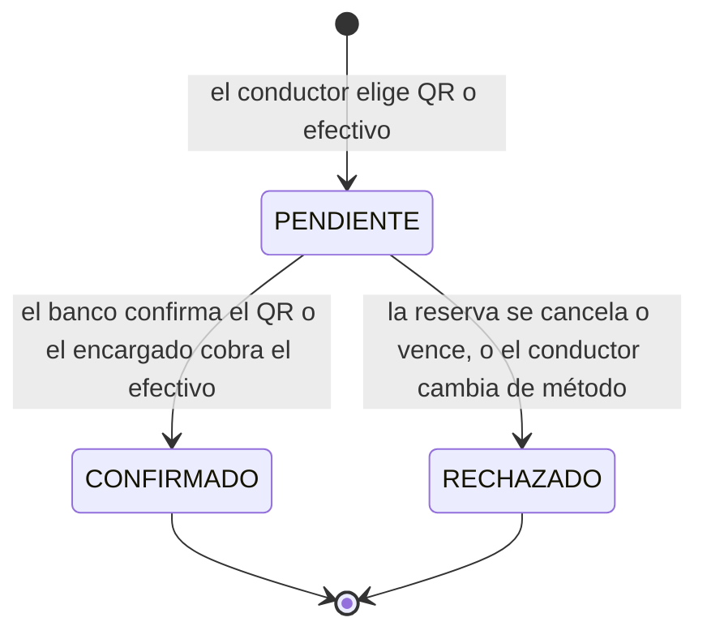
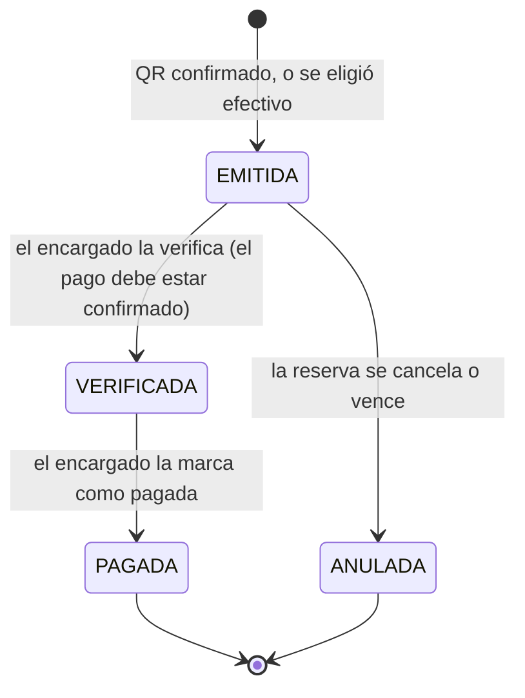

# Diagramas de estados

Estados reales del sistema, tomados de las restricciones de `backend/db/schema.sql` y de la lógica de la API.

## Reserva

```mermaid
stateDiagram-v2
  [*] --> ACTIVA: el conductor elige un lugar libre
  ACTIVA --> PAGADA: pago QR confirmado o cobro en efectivo
  ACTIVA --> CANCELADA: el conductor cancela (dentro de 5 min)
  ACTIVA --> EXPIRADA: pasan 5 minutos sin pagar
  PAGADA --> [*]
  CANCELADA --> [*]
  EXPIRADA --> [*]
```

## Lugar

```mermaid
stateDiagram-v2
  [*] --> LIBRE
  LIBRE --> RESERVADO: se crea una reserva
  RESERVADO --> LIBRE: reserva cancelada o expirada
  RESERVADO --> OCUPADO: reserva pagada
  note right of OCUPADO
    La liberación de un lugar ocupado
    no está definida en los requerimientos.
  end note
```

## Pago

```mermaid
stateDiagram-v2
  [*] --> PENDIENTE: el conductor elige QR o efectivo
  PENDIENTE --> CONFIRMADO: el banco confirma el QR o el encargado cobra el efectivo
  PENDIENTE --> RECHAZADO: la reserva se cancela o vence, o el conductor cambia de método
  CONFIRMADO --> [*]
  RECHAZADO --> [*]
```

## Ficha electrónica

```mermaid
stateDiagram-v2
  [*] --> EMITIDA: QR confirmado, o se eligió efectivo
  EMITIDA --> VERIFICADA: el encargado la verifica (el pago debe estar confirmado)
  VERIFICADA --> PAGADA: el encargado la marca como pagada
  EMITIDA --> ANULADA: la reserva se cancela o vence
  PAGADA --> [*]
  ANULADA --> [*]
```
